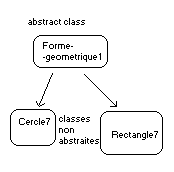

# day 4 Daily Java Drip(DJD)
## Objectif Global:
Ce cours fait partie d'un ensemble d'une séance de de cours sur le angage JAVA et qui va me permettre de réviser les base du langage.
Je partagerai quotidiennement les différentes parties de cette séance.
### Objectif du jour(l'Abstraction en Java)
L’abstraction est le processus qui consiste à représenter des objets qui appartiennent au monde réel dans le monde du programme que l’on écrit. Il consiste essentiellement à extraire des variables pertinentes, attachées aux objets que l’on souhaite manipuler, et à les placer dans un modèle informatique convenable.

## Classe abstraite
- Une classe abstraite est une classe qui ne définit pas toutes ses méthodes(le corps manque). Elle ne peut pas etre instanciée.
- Une classe concrète définit toutes ses méthodes. Elle peut hériter d'une classe abstraite et peut etre instanciée.

Avec les classes abstraites, on peut faire des programmes génériques.
  On définit les méthodes manquantes avec l'héritage, pour obtenir une classe concrète qu'on peut ensuite instancier et exécuter.

## Les interfaces
- Une interface en Java est comme une classe abstraite sans aucune définition de méthode, à partir de la version 8 vous pouvez ajouter des méthodes par défaut.
- L'interface décrit les méthodes et les types de leurs arguments sans rien dire sur leur implémentation.
- Les interfaces sont des variantes de l'héritage multiple.

## Le mot clé static
- Le mot clé static est utilisé pour désigner une propriété dont la valeur est identique pour tous les objets de la classe.
- Une méthode qui accède à une propriété static doit etre déclarée static.
- Les propriétés et méthodes static sont accécibles à partir du nom de la classe.
- Les propriétés et méthodes static sont appelées respectivement propriétés de classe et méthodes de classe.
- Les propriétés et méthodes non static sont appelées respectivement propriétés d'instance et méthodes d'instances.

## Le mot clé final
Une classe "final" ne peut pas etre étendue avec l'héritage => final class NotExtendable {//...}
- Une méthode "final" ne peut pas etre redéfinie avec l'héritage.
- C'est une bonne idée de définir toutes les classes comme "final" sauf celles pour lesquelles on veut laisser la possibilité d'extension par héritage.
